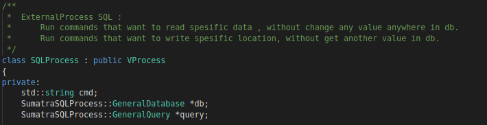

# Sumatra
</img>
</img>

## Why ?
We know that the most common problem in cybersecurity and servers is accessing unwanted data within the server through a code flaw or adding / changing certain data on the server.
At this point, we should think that when many vulnerabilities are detected, they can be solved by editing the codes or updating the packages; but this does not always guarantee that the vulnerabilities are or will be completed.
Both the process until a vulnerability is closed, and the process until a vulnerability is noticed or not, causes many problems.

## What is this ?
It is an automatic cybersecurity measure provider that sees the page templates to be transferred to the user on the servers or the database commands to be run on the server by the user **as a process as if they were on the operating system**. It authorizes the communication between these *"virtual"* processes according to the **privileges** , so stops access to unwanted data.

### More specifically
--------------------
More specifically, according to the pages and / or database accesses on the server, each connected user opens processes that depend on a permission structure that describes her/his access to these items (how and by what he can pull or change data on these items).
These virtual processes contain calls that run and terminate real processes, as if they were an operating system process.
In addition, the stdout channel that will transfer the result of the request to the screen of the browser, the stdin channel that is processed by pulling the URI parameters and the stderr channel that gives possible problems to the real server system are defined for all these processes.
In this way, transactions are communicated one after another in the transaction pool according to their authorization (this happens from a transaction running chain) and the result is transferred to the user without any problem.

</img>
</img>

 

### Example Scheme

              +---------------------First , Request-------------------------------------+
      REQUEST |                                                                         |
    +-------+ |                                                      Second, Create Virtual
    |       | |                                                                        +---------+
    | URI:  | |  +--------------------------------------------------------------+      | Real    |
    | /Main | |  |                                                              +<-stdin Server  |
    | ?a='.'+-+  |      +-------------------------+-------------------------+   |      |         |
    | #abc  |    |      |                         |                         |   |      |         |
    |       |    |      |  Any Page : /Main       |  SQL Database           |   |      | /Main   |
    |       |    |      |                         |  External Process       |   |      | /.html  |
    |       |    |      |  (Inherits Proc.)       |                         |   |      | /.css   |
    | Read  |    |      |  Have STDIN,OUT,ER      |  (Inherits Proc.)       |   |      | /.js    |
    | in    |    |      |                         |                         |   |      |         |
    | DB    |    |      |  Virtual Process        |  [] Privilege           |   |      |         |
    | And   |    |  +---+  [] Privilege           |  ...                    |   |      | Database|
    | Get   |    |  |   |  [] Where is ?          |                         |   |      |         |
    | Resp. |    |  |   |                         |                         |   |      |         |
    |       |    |  |   +----------Process Examples , Page or Database------+   |      |         |
    |       |    |  |                                                           |      |         |
    |       |    +-------------------Process Pipeline , all of have PID.--------+      +---+--+--+
    |       |       |                                                                      ^  |
    |       |       |                                                                      |  |
    |       |       +----------------stdout-------------sterr desc. Error------------------+  |
    +---+---+                                                                                 |
        ^                                                                                     |
        +--Response----------------------If your previlige OK,you can get data rq. by your proc.

## More sophisticated innovative approaches
--------------

</img>

This security system includes a **"server-side assembly"** (sasm) instruction set so that running processes can have different permission systems when they are triggered by routing from within the server. In this way, the virtual process to be opened as a result of an operation received from the user in any on-site redirection or server-side programming can be pre-defined with a simple set of commands according to where it is run.

E.g.

    .route 1
    
    SETPL 1
   
    SETPV 1
   
    CALL
  
    .route 2
  
    SETPL 2
  
    SETPV 1
  
    CALL

## Processes
The Sumatra system includes not only virtualizing pages like an operating system process, but also virtualizing and running a database layer that adapts its own permissions system. What I am aiming at here is a SQL management adapted to ensure that the executed sql commands, which are shown as virtual transactions, do not pull any unwanted data or create changes in the database.

</img>

## Future
I tried to show the maximum performance that i could implement this revolutionary mechanism according to my knowledge. In order to continue to develop and move forward, I will pay attention to its ability to be integrated with many different add-ons and to be even more universal.
